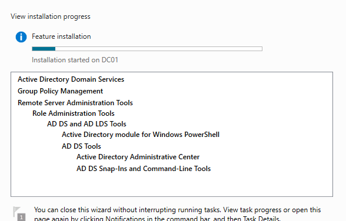
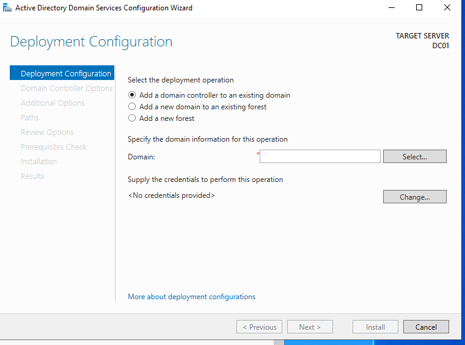
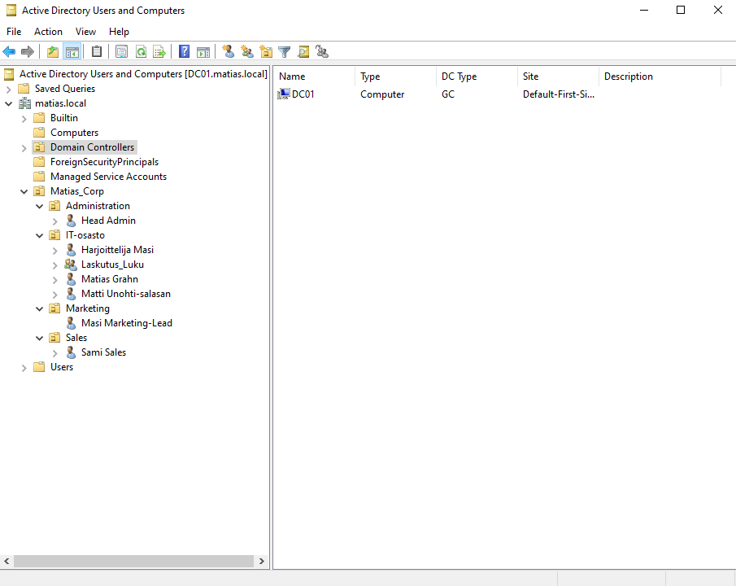
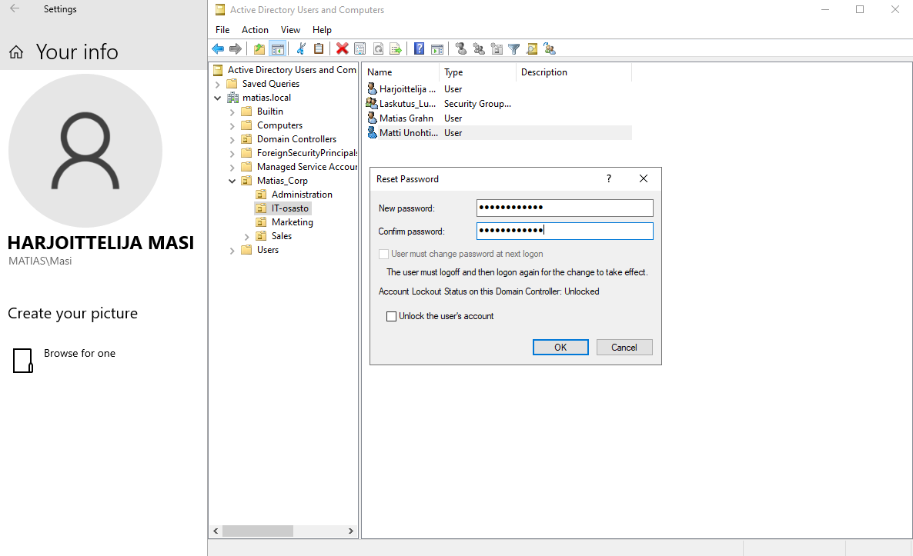
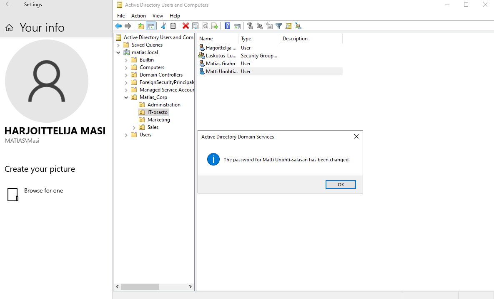
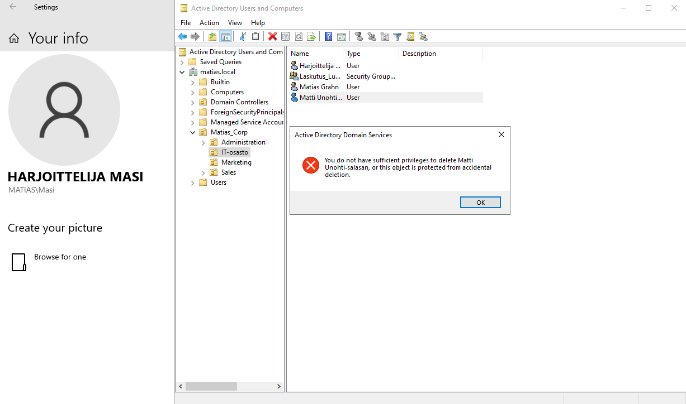
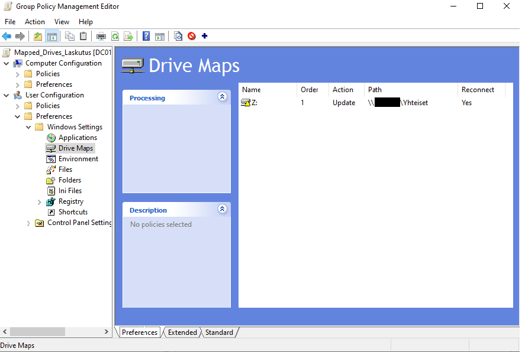
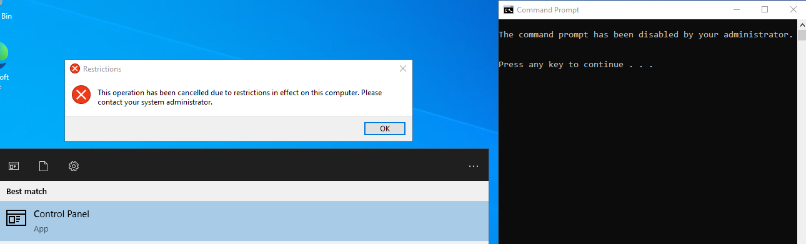

# AD-DS-Lab
"A practical lab for Identity and Access Management (IAM) featuring AD DS, GPO automation, and secure delegation of authority."

## 📌 Project overview

This project focuses on designing and implementing a secure Active Directory Domain Services (AD DS) environment using Windows Server 2022. The primary goal was to move beyond basic setup and implement enterprise-level security concepts, specifically the Principle of Least Privilege (PoLP) and Administrative Delegation.

The lab simulates a corporate IT infrastructure where support roles (Helpdesk) are granted granular permissions without compromising domain security.

## 🛠️ Technologies & Tools
* **Operating System:** Windows Server 2022
* **Directory Services:** Active Directory (AD DS)
* **Policy Management:** Group Policy Objects (GPO)
* **Virtualization:** VMware / VirtualBox
* **Networking:** DNS & Static IP configuration within a private lab network

## 🛠️ Installation & Setup
### Installing AD DS Role
Before implementing the scenarios, I prepared the Domain Controller (DC01).

### Domain Configuration
Next, I configured the server as the first Domain Controller in a new forest.

### 📂 Active Directory Organization & IAM
I designed and implemented a scalable Organizational Unit (OU) (test) hierarchy to manage corporate identities effectively.

## 🚀 Scenarios & Problem solving
### 1. Scenario: The "Forgotten Password" & Helpdesk Delegation
   *  Goal: Enable a Helpdesk technician to assist users with password resets without granting full Domain Admin privileges.
   *  Implementation: Used the Active Directory Delegation of Control Wizard to assign specific Reset Password permissions         to the "Helpdesk" user within a designated OU.
   *  Result: The technician could successfully reset user passwords and enforce "User must change password at next logon,"       but was blocked from unauthorized actions like deleting accounts (following the Principle of Least Privilege).
## User tries to change Password.

## User changed password successfully.

## When the same user tries to Delete a user.

### 2. Scenario: Automated Resource Access (GPO)
   * Goal: Ensure new employees have immediate access to departmental files without manual IT intervention.
   * Implementation: Configured a Group Policy Object (GPO) for Drive Mapping to automatically connect network shares based       on the user's security group.
   * Result: Upon login, the correct network drives appear automatically in the user's File Explorer.
## End-User View: Successfully Mapped Mapped Network Drive via GPO

## User-view, You can now physically see and access Z-Drive

### 3. Scenario: Workstation Hardening & Security
   * Goal: Prevent standard users from accessing sensitive system settings or running potentially harmful commands.
   * Implementation: Applied GPOs to restrict access to the Control Panel and the Command Prompt (CMD) for non-                    administrative accounts.
   * Result: Standard users receive a "This operation has been cancelled due to restrictions" notification when attempting         to access these tools.
## Trying to open CMD and Control Panel as a restricted user.

### 4. Scenario: Core Infrastructure & Connectivity
   * Goal: Establish a stable foundation where workstations can discover and join the corporate domain.
   * Implementation: Configured Static IP addressing and DNS settings on the Domain Controller to ensure reliable name             resolution within the lab network.
   * Result: Successful Domain Join for client workstations and seamless communication between the server and its nodes.

## 💡 Key Learnings
* **Identity & Access Management (IAM):** Deepened understanding of managing user lifecycles and permissions securely.
* **Security-First Mindset:** Implementing the Principle of Least Privilege to minimize internal risks.
* **Infrastucture Troubleshooting:** Solving real-world connectivity and permission issues (DNS, UAC, Inheritance).
